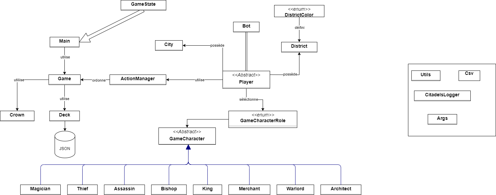

# Citadelles - Équipe E

Bienvenue dans Citadelles !
[Version anglaise](README-en.md)

Ce projet a été développé dans le cadre d'un projet collaboratif en programmation. Il s'agit d'un programme en Java permettant à 4 robots de jouer à la première édition du jeu Citadelles.

---

## Table des matières

- [Sujet](#sujet)
- [Membres de l'équipe](#membres-de-léquipe)
- [Instructions d'utilisation](#instructions-dutilisation)
  - [Prérequis](#prérequis)
  - [Installation](#installation)
  - [Exploration du Projet](#exploration-du-projet)
- [Utilisation](#utilisation)
  - [Compiler et Exécuter](#compiler-et-exécuter)
  - [Exécution des Tests](#exécution-des-tests)

<div style="page-break-before: always;"></div>


## Sujet

Ce projet vise à créer une version informatisée du jeu "Citadelles", en se basant sur la première édition, en intégrant les fonctionnalités suivantes :

### Fonctionnalités :

- **Interface de jeu :**
  - Représentation des cartes et des villes de chaque joueur.
- **Moteur de jeu :**
  - Gestion de la mise en place, des tours, des actions, des interactions, de la progression et de la fin de la partie.
- **Développement de robots de jeu :**
  - Du niveau de base jusqu'à des stratégies sophistiquées démontrables.
- **Simulation de parties :**
  - Implémentation d'une simulation de partie entre 4 robots, avec calcul des points et établissement d'un classement à la fin.
- **Visualisation textuelle simplifiée :**
  - Affichage textuel de l'état actuel du jeu.
<div style="page-break-before: always;"></div>


## Membres de l'équipe

Ce projet a été réalisé par l'équipe Polytâche (E), composée de 4 étudiants de 3ᵉ année de la promotion 2023 de Polytech Nice Sophia en filière Sciences Informatiques (SI) :
- [Darina Chan](https://github.com/DarinaChan)
- [Océan Razafiarison](https://github.com/Oceanraza)
- [Mathis Jullien](https://github.com/Mathis-Jullien)
- [Quentin Elleon](https://github.com/QuentinELLEON)

## Instructions d'utilisation

### Prérequis

Avant d'utiliser ce programme, assurez-vous d'avoir les éléments suivants installés sur votre machine :

- **Java 17** : Le projet est développé en Java 17. Vous pouvez le télécharger depuis le [site officiel d'OpenJDK](https://jdk.java.net/17/).

- **Git** : Si vous ne l'avez pas déjà, installez Git depuis le [site officiel de Git](https://git-scm.com).

- **Maven** : Utilisé pour compiler et exécuter le programme, vous pouvez le télécharger depuis le [site officiel de Maven](https://maven.apache.org/download.cgi).

### Installation

Pour installer le programme :

Ouvrez une console et placez-vous dans le répertoire où vous souhaitez télécharger le programme.
```bash
git clone https://github.com/pns-si3-projects/projet2-ps-23-24-citadels-2024-e.git
cd projet2-ps-23-24-citadels-2024-e
```

### Exploration du Projet

- **'src/main/java/fr/cotedazur/univ/polytech/startingpoint'** : Contient le code source.
- **'src/test/java/fr/cotedazur/univ/polytech/startingpoint'** : Contient les tests unitaires.

## Utilisation

### Compiler et Exécuter

Assurez-vous d'être dans le répertoire racine du projet (**'projet2-ps-23-24-citadels-2024-e'**). Vous pouvez alors compiler et exécuter le programme principal avec la commande Maven suivante :

```bash
mvn exec:java
```

### Exécution des Tests

Les tests unitaires sont situés dans le répertoire `src/test/java/fr/cotedazur/univ/polytech/startingpoint`. Pour les exécuter, utilisez la commande suivante :

```bash 
mvn clean package
```

Assurez-vous que tous les tests passent sans erreurs, confirmant ainsi la solidité du programme.
<div style="page-break-before: always;"></div>

# Point d'avancement

## Fonctionalités réalisées
  `Toutes` les fonctionalités `basiques` du plateau de jeu ont étés réalisées.
  Les seules règles n'ayant pas étés traitées sont celles des limitations techniques d'un jeu de société (nombre de pièces dans la banque).

## Système de logs
  Les logs ont étés réalisés à l'aide de la librairie de logging interne a java (java.util.logging). 
  - `Problème :` Nous avons besoin de régler les logs en deux parties différentes puisque nous ne devons pas avoir les logs d'une partie normale (description de chaque joueur, leurs choix...etc) lors de l'éxécution des 2x1000 parties.
  - `Solution :` Pour pallier à ce problème, nous avons crée un second logger avec un niveau différent du premier, ce qui nous permet donc d'activer ou de désactiver le logger non voulu à notre guise. 

## Archive des statistiques sous forme de CSV
  Lorsque nous mettons comme argument --csv, nous sauvegardons alors les parties jouées. 20 parties sont jouées et nous obtenons un CSV de la forme suivante :
  
  Il est bon de noter que lorsque nous réexcutons la même commande avec --csv, les données sont agrégées et les scores moyens sont recalculés (scoreInitial + nouveauScore)/2
  **Explication rapide :**
  - *Main.java :* C'est ici que les nouvelles données sont stockées et calculées avant de les envoyer au programme les rajoutant dans le CSV. Elles sont stockées sous la forme de deux HashMap, les deux ayant pour clé le nom du joueur mais avec une différence dans leur valeur :
      `totalScores` associe son score à un joueur.
      `totalPlacements` associe un array de quatre entiers représentant la 1ère place, 2e place... à un joueur, donnant donc le nombre de fois où il a obtenu cette place.
  - *Csv.java :* C'est ici que les données sont injectées dans le Csv. Son principe est simple et se divise en deux parties : 
      `Vérification de l'existence du fichier` , s'il n'existe pas, en créer un avec les en-têtes de colonnes (resetStats).
      `Rajout de données ` si le fichier existe, lire les données déjà existantes et les additionner (ou dans le cas des scores, faire une moyenne) avec celles que nous voulons rajouter. Cela est géré en regardant la colonne n°1 qui est le nom du joueur et en ajoutant ses valeurs a la liste envoyée par Main correspondante.
      `Si le joueur n'est pas déjà dans la base de données ` mais que nous avons d'autres joueurs déjà présents, il sera alors rajouté à la fin.
      `Enfin` le fichier est reinitialisé, nous rajoutons les en-têtes et les nouvelles données.

## Bot Richard
//Océan-Mathis

## Pourquoi Einstein bat-il Richard ?

*Einstein joue pour lui-même :* La principale différence vient du fait qu'Einstein joue pour lui-même et pour maximiser
ses propres chances. Il va essayer de récupérer le plus d'argent possible et de construire ses bâtiment le plus vite
possible. `A l'instar `de Richard qui lui essaie de déstabiliser ses adversaires et de les faire perdre. Dans une partie
avec quatre joueurs, celui se priorisant sur les autres est voué à être plus performant sur le long terme en général.

---

# Architecture du projet



L'architecture de notre projet a été conçue avec une approche modulaire et orientée objet, ce qui nous a permis de
maintenir une séparation claire des responsabilités tout en facilitant l'extensibilité. Au cœur de notre application, la
classe `Game` orchestre la logique de jeu, s'appuyant sur des composants spécialisés tels que `ActionManager` pour gérer
les actions des joueurs et `GameState` pour suivre l'état courant du jeu. Nous avons opté pour des classes abstraites
telles que `Player` et `GameCharacter` pour fournir des modèles extensibles pour les différentes entités du jeu, comme
les personnages `King`, `Assassin`, entre autres. Cette décision a été guidée par la volonté de faciliter l'ajout de
nouveaux types de joueurs et de personnages sans perturber la logique existante. De plus, l'emploi de fichiers JSON pour
la gestion des données de jeu offre une flexibilité dans la manipulation et la persistance des états de jeu.

### Localisation des Informations

La documentation [JavaDoc](doc/javadoc/index.html), générée et structurée de manière exhaustive, sert de référence
principale pour la compréhension des points clés et des classes importantes du projet. Chaque fichier HTML de
documentation, comme `Game.html`, `ActionManager.html`, ou encore ceux situés dans les dossiers `character` et `city`,
contient des informations détaillées sur les responsabilités et les comportements des classes et méthodes. Cette
documentation est un outil précieux pour les développeurs actuels et futurs afin de se familiariser rapidement avec le
projet.

### État de la Base de Code

//Mathis
(Rajouter image de la couverture de code et de sonarqube ?)

---

# Processus
  Le projet est divisé en plusieurs catégories toutes différentes les unes des autres :
  - `Personnages :` Quentin et Darina.
  - `Merveilles :` Mathis et Océan.
  - `Planification et gestion de l'architecture du projet :` Océan.
  - `Stratégie Richard :` Mathis et Océan.
  - `Stratégie Einstein :` Quentin et Darina.
  - `Implémentation Jcommander :` Darina.
  - `2x1000 et csv :` Quentin.
  - `Logger :` Mathis.
  - `Calcul des scores :` Mathis.
  - `Tests unitaires et Mocks :` Tout le monde mais surtout Darina.

  *Process de l'équipe :*
  //Mathis


Nous espérons que vous apprécierez l'utilisation de notre programme ! N'hésitez pas à lancer plusieurs parties pour découvrir les différentes possibilités.