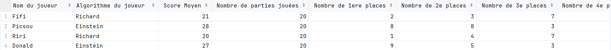

# Rapport de Projet : Citadelles - Équipe E

## Auteurs

- [Darina Chan](https://github.com/DarinaChan)
- [Océan Razafiarison](https://github.com/Oceanraza)
- [Mathis Jullien](https://github.com/Mathis-Jullien)
- [Quentin Elleon](https://github.com/QuentinELLEON)
## Sommaire

- [Introduction](#introduction)
- [Fonctionnalités Réalisées](#fonctionnalités-réalisées)
    - [Liste des Fonctionnalités](#liste-des-fonctionnalités)
- [Système de Logs](#système-de-logs)
- [Archive des Statistiques sous forme de CSV](#archive-des-statistiques-sous-forme-de-csv)
- [Stratégie du Bot Richard](#stratégie-du-bot-richard)
- [Analyse : Pourquoi Einstein bat-il Richard ?](#analyse-pourquoi-einstein-bat-il-richard-)
- [Architecture du Projet](#architecture-du-projet)
    - [Localisation des Informations](#localisation-des-informations)
    - [Tests du projet](#tests-du-projet)
    - [État de la Base de Code](#état-de-la-base-de-code)
- [Processus de Développement](#processus-de-développement)
- [Conclusion](#conclusion)

## Introduction

Dans le cadre d'un projet collaboratif en programmation, notre équipe, composée de quatre étudiants de Polytech Nice
Sophia, a développé un programme en Java permettant à quatre robots de jouer à la première édition du jeu Citadelles. Ce
rapport vise à présenter les avancées significatives du projet, les défis rencontrés et les solutions apportées, ainsi
que l'architecture du système développé.

## Fonctionalités réalisées

`Toutes` les fonctionalités du plateau de jeu ont étés réalisées. N'ont seulement pas été traitées des règles très
spécifiques.

## Fonctionnalités non réalisées

Spécifiquement, les règles que nous n'avons pas traitées sont les suivantes

- Limitation du nombre de pièces dans la banque à 30 comme dans le jeu de société.
- Si égalité entre deux joueurs et que l'un est assassiné au dernier tour, il ne gagne pas.
- Le condottiere ne peut pas casser un district d'un joueur en ayant 8 ou plus.
- Un joueur qui a choisi l'évêque, mais qui s'est fait tuer, n'est plus protegé contre le condottiere.

Avec architecture mise en place, ces fonctionnalités sont implémentables relatively facilement. Étant donné qu'elles
sont très spécifiques, l'effort à produire serait principalement au niveau des tests. Concernant la limitation du nombre
de pièces dans la banque, les parties jouées avec des bots intelligents ne devraient pas poser de problème si les pièces
sont limitées. Cependant, si des parties étaient jouées avec des bots aléatoires, il est possible que la banque se
retrouve à court de pièces. D'où la nécessité de faire piocher les bots dans ce cas-là, en attendant que les pièces
retournent à la banque.

### Liste les fonctionalités réalisées

## Système de logs

Les logs ont étés réalisés à l'aide de la librairie de logging interne à java (java.util.logging).

- `Problème :` Nous avons eu besoin de régler les logs en deux parties différentes puisque nous ne devons pas avoir
  les logs d'une partie normale (description de chaque joueur, leurs choix, etc.) lors de l'exécution des 2x1000 parties
  ou lors de la génération du csv.
- `Solution :` Pour pallier ce problème, nous avons créé notre propre logger à deux niveaux différents.
  Cela nous permet, en appelant une méthode de notre classe CitadelsLogger, de choisir le niveau de logs à afficher
  selon,
  si la commande de démonstration est utilisée, ou si on utilise les commandes jouant plusieurs parties.

Pour que l'affichage des logs corresponde à nos attentes, nous avons reformaté nos deux niveaux de logs. Ceci pour
enlever notamment les informations de date et d'heure, et garder l'essentiel. Nous avons également ajouté des
couleurs pour faciliter la lecture des parties, ce qui nous a fait gagner du temps lors des phases de debug.

## Archive des statistiques sous forme de CSV

Lorsque nous mettons comme argument --csv, nous sauvegardons alors les parties jouées. 20 parties sont jouées et nous
obtenons un CSV de la forme suivante :

Il est bon de noter que lorsque nous réexcutons la même commande avec --csv, les données sont agrégées et les scores
moyens sont recalculés (scoreInitial + nouveauScore)/2
**Explication rapide :**

- *Main.java :* C'est ici que les nouvelles données sont stockées et calculées avant de les envoyer au programme les
  rajoutant dans le CSV. Elles sont stockées sous la forme de deux HashMap, les deux ayant pour clé le nom du joueur
  mais avec une différence dans leur valeur :
  `totalScores` associe son score à un joueur.
  `totalPlacements` associe un array de quatre entiers représentant la 1ère place, 2e place... à un joueur, donnant donc
  le nombre de fois où il a obtenu cette place.
- *Csv.java :* C'est ici que les données sont injectées dans le Csv. Son principe est simple et se divise en deux
  parties :
  `Vérification de l'existence du fichier` , s'il n'existe pas, en créer un avec les en-têtes de colonnes (resetStats).
  `Rajout de données ` si le fichier existe, lire les données déjà existantes et les additionner (ou dans le cas des
  scores, faire une moyenne) avec celles que nous voulons rajouter. Cela est géré en regardant la colonne n°1 qui est le
  nom du joueur et en ajoutant ses valeurs a la liste envoyée par Main correspondante.
  `Si le joueur n'est pas déjà dans la base de données ` mais que nous avons d'autres joueurs déjà présents, il sera
  alors rajouté à la fin.
  `Enfin` le fichier est reinitialisé, nous rajoutons les en-têtes et les nouvelles données.

## Bot Richard

Le bot RichardAlgo implémente une stratégie nuancée visant à optimiser chaque mouvement en fonction des positions des
joueurs et de la phase du jeu. Voici un résumé des stratégies clés employées par RichardAlgo pour guider les joueurs
novices et expérimentés :

### Stratégie de base

#### Assassin

- **Usage sélectif contre le Voleur :** L'Assassin ne cible le Voleur que pour empêcher un joueur de s'enrichir de
  manière excessive ou si le Voleur est choisi par un concurrent direct pour la victoire. Cela car le Voleur ne peut pas
  voler l'Assassin, éliminant un risque direct tout en neutralisant une menace pour les adversaires.
- **Prudence avec le Condottiere :** L'Assassin évite de cibler le Condottiere à moins d'être en tête ou de soupçonner
  le Condottiere d'être choisi par un joueur proche de la victoire. Cela minimise les risques pour l'Assassin, sauf dans
  des circonstances très spécifiques.

#### Architecte

- **Contrôle du leader :** L'Architecte est évité par les joueurs bien placés pour prévenir une avance décisive. Si un
  joueur peut potentiellement faire un bond significatif dans sa construction, les autres joueurs doivent intervenir
  pour empêcher cette situation, idéalement en choisissant l'Assassin pour éliminer l'Architecte du tour.

#### Roi

- **Interruption de séquences gagnantes :** Le Roi est une cible prioritaire pour empêcher un joueur en position de
  gagner de jouer en premier dans le prochain tour et de choisir des personnages clés comme l'Assassin. Les joueurs
  doivent ajuster leur sélection de personnages pour contrer stratégiquement ce joueur.

### Dernier tour

- **Blocage du joueur en tête :** Si un joueur est sur le point de construire son dernier quartier, les adversaires
  doivent utiliser une combinaison de personnages pour bloquer ou ralentir sa progression. Cela peut inclure
  l'utilisation de l'Assassin pour éliminer des personnages clés ou du Condottiere pour détruire un quartier crucial.

## Pourquoi Einstein bat-il Richard ?

*Einstein joue pour lui-même :* La principale différence vient du fait qu'Einstein joue pour lui-même et pour maximiser
ses propres chances. Il va essayer de récupérer le plus d'argent possible et de construire ses bâtiments le plus vite
possible. `A l'instar `de Richard qui lui essaie de déstabiliser ses adversaires et de les faire perdre. Dans une partie
avec quatre joueurs, celui se priorisant sur les autres est voué à être plus performant sur le long terme en général.

---

# Architecture du projet

L'architecture de notre projet a été conçue avec une approche modulaire et orientée objet, ce qui nous a permis de
maintenir une séparation claire des responsabilités tout en facilitant l'extensibilité. Au cœur de notre application, la
classe `Game` orchestre la logique de jeu, s'appuyant sur des composants spécialisés tels que `ActionManager` pour gérer
les actions des joueurs et `GameState` pour suivre l'état courant du jeu. Nous avons opté pour des classes abstraites
telles que `Player` et `GameCharacter` pour fournir des modèles extensibles pour les différentes entités du jeu, comme
les personnages `King`, `Assassin`, entre autres. Cette décision a été guidée par la volonté de faciliter l'ajout de
nouveaux types de joueurs et de personnages sans perturber la logique existante. De plus, l'emploi de fichiers JSON pour
la gestion des données de jeu offre une flexibilité dans la manipulation et la persistance des états de jeu.

Toutefois, on peut noter que les parties de l'architecture du projet sont plus ou moins bien réalisées. Par exemple, la
gestion des actions des joueurs est bien réalisée avec la classe `ActionManager` pour gérer les actions des joueurs.
Cependant, la gestion des personnages est moins bien réalisée. En effet, la classe RichardAlgo suit un algorithme,
mais aurait pu mieux être implémenté de manière à uniformiser les stratégies des bots. On peut noter qu'on aurait pu
utiliser des design patterns pour améliorer l'architecture du projet (singleton pour le game, factory pour les
personnages, factory pour les cartes, observer pour les actions des joueurs, etc).

## Desing Patterns

- `Singleton :` Utilisé pour le logger avec la classe ``CitadelsLogger``.
- `Command :` Utilisé pour les actions des joueurs avec la classe ``ActionManager``.
- `Strategy :` Utilisé pour les stratégies des bots avec les classes ``RichardAlgo`` et ``EinsteinAlgo``.
- `State :` Utilisé pour les états du jeu avec la classe ``GameState``.
### Localisation des Informations

La documentation [JavaDoc](javadoc/index.html), générée et structurée de manière exhaustive, sert de référence
principale pour la compréhension des points clés et des classes importantes du projet. Chaque fichier HTML de
documentation, comme `Game.html`, `ActionManager.html`, ou encore ceux situés dans les dossiers `character` et `city`,
contient des informations détaillées sur les responsabilités et les comportements des classes et méthodes. Cette
documentation est un outil précieux pour les développeurs actuels et futurs afin de se familiariser rapidement avec le
projet.

### Tests du projet

Le projet a été principalement testé avec des tests unitaires afin d'isoler le comportement de chacune des fonctions et
assurer la qualité de ces dernières, mais aussi avec des tests d'intégration pour assurer la cohérence entre les
différentes briques du système. Nous pouvons par exemple citer les packages `character` ainsi que `city` contenant les
classes pour les quartiers, qui sont couverts à plus de 90%.

Des mocks ont été nécessaires afin de correctement isoler et simplifier certains tests unitaires impliquant des "gros"
objets et de l'aléatoire. Notamment, dans le `RandomAlgoTest` où nous avons pu tester la
fonction `drawStartOfTurnChoiceTest()` en mockant `getRandomBoolean()` qui renvoie vrai ou faux de manière aléatoire, de
sorte à pouvoir user des deux cas sans dépendre de l'aléatoire.

Cependant, certaines classes implémentées durant la semaine à temps complet n'ont pas été intégrées convenablement. En
effet, c'est par exemple le cas des fonctions de `Csv` ou encore du package `bot`. De plus, nous n'avons testé que
partiellement le `RandomAlgo`. Nous avons rencontré des difficultés lorsqu'il fallait mock des listes telles
que `availableChars` ou `charactersInGame`, définies et instanciées dans la classe `Game` au travers d'une fonction.

## Analyse de la Base de Code

À partir du moment où SonarQube nous a été introduit, nous avons mis en place des analyses régulières de notre code.
Cela nous a permis de détecter des problèmes de qualité de code, des bugs potentiels et de suivre les évolutions de
notre couverture de test. Nous avons fait l'effort d'analyser régulièrement notre code pour améliorer sa qualité et
éviter un maximum de code smells. Nous arrivons ainsi à un nombre inférieur 20 code smells, 0 bugs, 0 vulnérabilités
et 0% de duplication de code.

Concernant la couverture de nos tests, nous avons atteint un taux de 60% de couverture de code. Nous n'avons donc pas
atteint les 80% recommandés. Ce choix se justifie par la focalisation sur les tests des parties les plus complexes,
c'est-à-dire du jeu en lui-même et des algorithmes de nos bots. La création et gestion du fichier csv ainsi que des
commandes de lancement de parties n'ont pas été testées. Ce serait une amélioration à apporter pour une prochaine
version. Ainsi, même si les tests pourraient être plus nombreux, nous avons confiance en la qualité de notre code et
du déroulement correct des parties.

De plus, nous avons utilisé la visualisation sous forme de ville de notre code proposée par SonarQube pour avoir une
vue globale de notre code et son architecture.

Chaque quartier représente un package, et chaque bâtiment représente une classe. Les couleurs des bâtiments indiquent
la complexité cyclomatique de la classe. La classe en rouge représente la classe la plus complexe, c'est-à-dire
l'algorithme de Richard qui contient un grand nombre de conditions que nous avons essayé de relier le plus au métier
pour
qu'elles soient compréhensibles. Les deux autres classes complexes sont Game qui contient toute la logique du jeu et
Main qui contient les commandes de lancement de parties. La hauteur représente les lignes de code qui sont importantes
pour ces mêmes classes. En excluant ces trois classes qui seraient à retravailler, nous pouvons en déduire que notre
architecture est répartie grâce aux packages et équilibrée.

---

# Processus

Le projet est divisé en plusieurs catégories toutes différentes les unes des autres :

- `Personnages :` Quentin et Darina.
- `Merveilles :` Mathis et Océan.
- `Planification et gestion de l'architecture du projet :` Océan.
- `Stratégie Richard :` Mathis et Océan.
- `Stratégie Einstein :` Quentin et Darina.
- `Implémentation Jcommander :` Darina.
- `2x1000 et csv :` Quentin.
- `Logger :` Mathis.
- `Calcul des scores :` Mathis.
- `Tests unitaires et Mocks :` Tout le monde mais surtout Darina.

*Process de l'équipe :*

Notre équipe suit un processus de développement méthodique qui comprend les étapes suivantes :

- La création d'issues détaillées et verticales pour chaque tâche. Comprenant leurs descriptions et l'attribution
  à un membre de l'équipe. Chaque issue apporte de la valeur ajoutée au projet et est associée à un milestone qui
  représente un objectif cohérent à court terme (une semaine généralement).
- Pour chaque contribution au projet, nous utilisons des commits respectant la convention de commit conventionnel
  (conventional commit), assurant ainsi une traçabilité claire des modifications apportées.
- Chaque branche puis pull request est liée à une issue spécifique et est soumise à une revue approfondie par
  au moins un membre de l'équipe.
- Nous maintenons une norme de codage rigoureuse pour garantir la qualité du code, en accord avec les pratiques
  de l'industrie.
- Notre stratégie de branching Git Flow comprend les branches Master, Develop et les branches de fonctionnalités.
  Les fonctionnalités sont développées sur des branches distinctes, liées à des issues spécifiques,
  et fusionnées dans Develop une fois terminées. La branche Develop est stable, à chaque fois qu'un milestone est
  terminé, nous créons une Pull Request pour que le code stable soit livré en production sur la branche Master.
- En complément de cette stratégie de branche, à chaque fois qu'un push est effectué ou qu'une pull request
  est créée, des vérifications et tests sont effectués. Si la pull request affecte les branches Master et Develop,
  les tests et le build sont exécutés.

Nous espérons que vous apprécierez l'utilisation de notre programme ! N'hésitez pas à lancer plusieurs parties pour
découvrir les différentes possibilités.